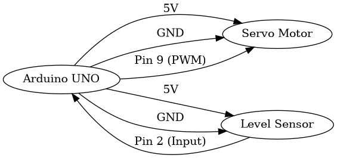

# Smart Infusion Monitoring System

Smart Infusion Monitoring System with AI-based prediction for automated IV bottle management.

This project combines IoT hardware (Arduino) with a Python-based AI dashboard to monitor fluid levels, predict depletion, and automate bottle replacement.

---

## Features

* Detects empty IV bottle automatically
* Predicts future fluid levels using AI
* Estimates time remaining before depletion
* Real-time monitoring dashboard
* Reduces manual workload in hospitals

---

## AI Module

This project includes a separate AI module (`ai_model.py`) that:

* Uses Linear Regression for prediction
* Analyzes historical fluid level data
* Predicts future depletion trends
* Estimates time-to-empty for proactive alerts

---

## System Workflow

1. Fluid level decreases over time (simulated or real sensor input)
2. Data is stored and tracked continuously
3. AI model analyzes past data
4. System predicts future fluid levels
5. Dashboard displays real-time status and alerts

---

## How to Run (Dashboard)

1. Install dependencies:

   ```
   pip install flask numpy scikit-learn
   ```

2. Run the application:

   ```
   python app.py
   ```

3. Open in browser:

   ```
   http://localhost:3000
   ```

---

## Hardware Implementation

* Upload `arduino_code.ino` using Arduino IDE

### Connections:

* Sensor → Pin 2
* Servo Motor → Pin 9

---

## Project Structure

* `app.py` → Main dashboard application
* `ai_model.py` → AI prediction module
* `arduino_code.ino` → Hardware control code
* `main.py` → Basic simulation
* `README.md` → Documentation

---

## Project Type

Simulation + Hardware Integrated System

---

## Future Improvements

* IoT-based remote monitoring
* Mobile application integration
* Cloud data storage
* Advanced machine learning models
## Circuit Diagram



---

## Author

Madhwan Pratap
